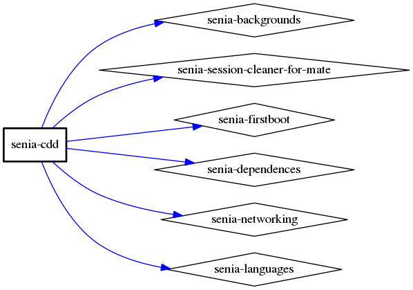
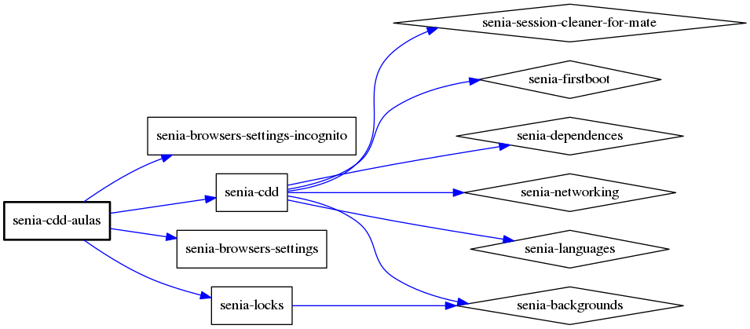
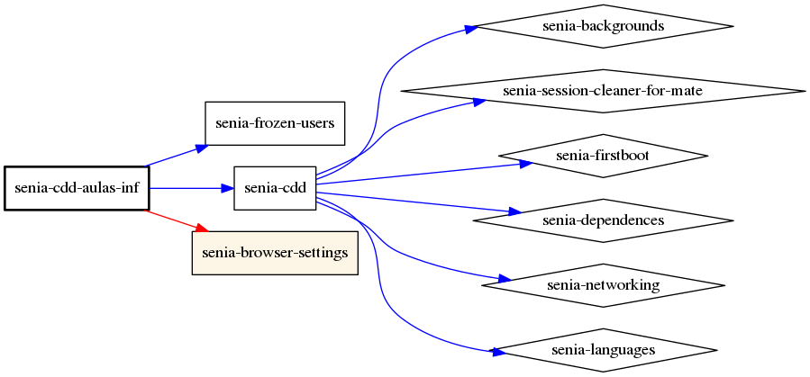
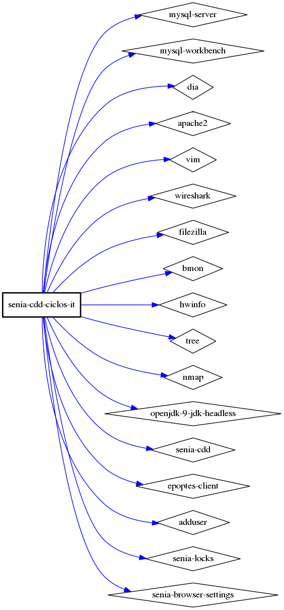
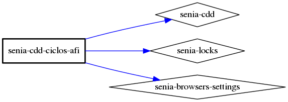

# Senia CDD 

Documentacion de los diferentes paquetes y necesidades de Software de las aulas del centro
IES La Senia de Paiporta, aunque podría adaptarse a cualquier centro educativo. 

Actualmente contamos con configuracion y paqueteria que aplica a las diferentes aulas e infraestructura
del centro.

En la versión 20.04 del PPA para el IES La Senia, el escritorio se basa en XFCE. La posibilidad de configurar el Escritorio, así como de establecer blindajes lo suficientemente fuertes para que el alumnado no pueda cambiar el escritorio y no permitir su correcta utilización por parte de otros usuarios.

## Creación Imágen de Instalación

Utilizando *cubic* se ha realizado una *customización* de Xubuntu 20.04. Los únicos cambios que deben hacerse son:

### modo-interactivo

```shell
sudo add-apt-repository ppa:ticsenia/ppa
sudo apt install senia-cdd-ciclos-it plymouth-theme-xubuntu-logo
``` 

### preseed

De la ruta: [Preseed](tools/preseed), copiamos el contenido del fichero a *xubuntu.preseed* que luego acabará dentro del directorio */cdrom/*.

### Generacion Password Preseed

Para la generación del Password del usuario, en el fichero de preseed, se debe pegar el texto que que se obtiene de 
la generación del *md5* utilizando `mkpasswd`:

```shell
printf "PASSWORD" | mkpasswd -s -m md5
```

### Instalación desatendida

La opción "Senia Desatendida" nos permite realizar la instalación de manera desatendida. 


# Arboles de dependencias

## Sabor minimo

Se trata del conjunto minimo de la Senia, en el se instalan los diferentes lenguajes y utilidades
de la Senia, tales como el Nagios, etc.




## Senia Aulas centro

En este conjunto además de **senia-cdd** se incorporan los paquetes que no permiten cambiar el aspecto
del escritorio y el fuerza al firefox a estar siempre en modo incognito



## Senia Aulas Informatica 




## Senia Ciclos IT



## Senia Ciclos AFI




